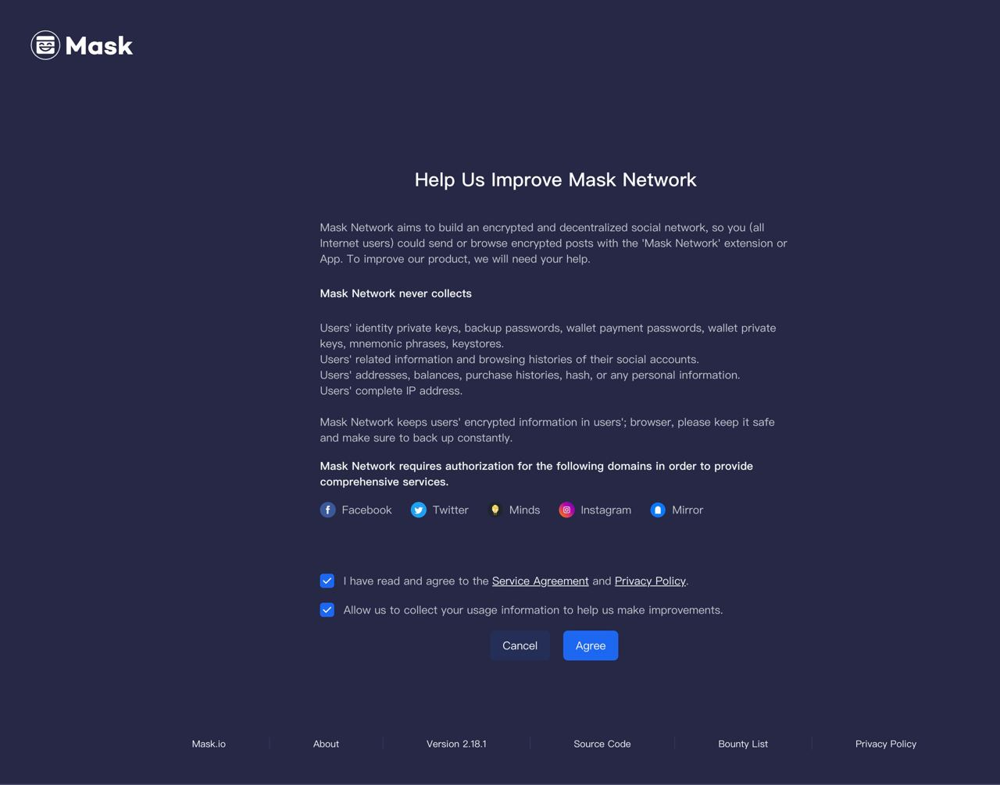

# Installation from source

## Steps

1. Go to the latest Actions page of the develop branch in the GitHub repository, which can be accessed using the following link: https://github.com/DimensionDev/Maskbook/actions?query=branch:develop
2. Download the build that you need to test and extract it into a single folder.
3. Open the extension page of your browser, for instance, in Chrome, you can open it using the URL chrome://extensions/.
4. Drag the source code into the extension page and wait for a few seconds until the dashboard page opens automatically.

## Screenshot

By following these steps, you can test the latest version of the codebase, and ensure that your browser extension is functioning properly. These steps are concise and easy to understand, and can be easily followed by anyone who is unfamiliar with the testing process.